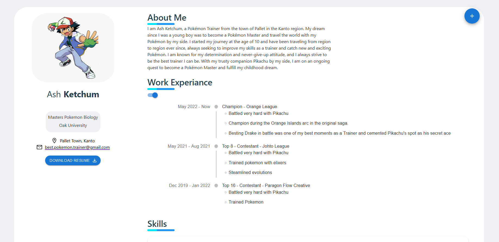

# Resume website
## About
This is a clean resume website template for anyone to use. 

 ## Features
 * Contact page, using getform.io
 * About me section, for your information
 * Portfolio, insert multiple projects

## Technical 
The main UI was mostly developed using [material UI](https://mui.com/).  In addition, the blog page uses [GraphQl](https://graphql.org/) to query through the different projects in the porfolio blog.

## How to configure

 1. Clone the repository
 2. Use ``yarn add`` to import the nessessary packages.
 3. Inside ``src/assets`` you can customize the template for the resume website
 4. Once finished, call ``yarn build`` to export the function as a static website, public folder
